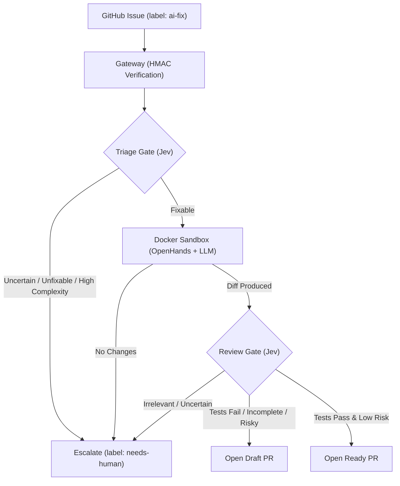
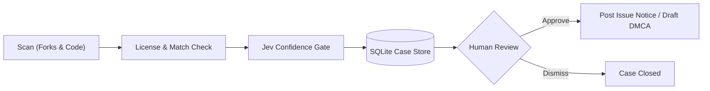

# AI Software Engineer Agent

Autonomous issue-fixing and license-compliance watchdog powered by Claude, OpenHands, and TypeSafe Jev.

- **Issue Fixer:** Triages GitHub issues, writes fixes inside Docker sandboxes, verifies tests, and opens PRs with typed safety gates.
- **Watchdog:** Discovers unlicensed repo copies, calculates violation confidence, and drafts human-approved notices or DMCA requests.

---

## How It Works

### 1. Issue Fixer Workflow



### 2. Watchdog Workflow



---

## Repository Layout

| Directory | Stack | Responsibility |
|---|---|---|
| `core/` | Python 3.13+, `pyright --strict` | Pipeline state machine, Jev gates, Docker runner, CLI (`agent`). |
| `gateway/` | TypeScript, Node 22 | Webhook receiver, HMAC validation, OpenAPI client. |
| `scripts/` | Shell | CI contract drift verification (`check-drift.sh`). |

---

## Quickstart

```bash
cp .env.example .env    # Configure tokens
cd core && uv sync --all-extras

# Run directly:
uv run agent fix https://github.com/OWNER/REPO/issues/1

# Or run API server + Webhook Gateway:
uv run agent serve
cd ../gateway && npm ci && npm run build && npm start
```

Point GitHub repository webhook (`Issues` event, JSON) to `https://<host>/webhook`.

---

## LLM & Gate Configuration

### TypeSafe Jev Gate
Evaluates triage and PR risk deterministically. Can be run directly via TypeSafe or through OpenRouter:

```bash
export TYPESAFE_API_KEY=<openrouter-key>
export SWE_AGENT_JEV_BASE_URL=https://openrouter.ai/api
export SWE_AGENT_JEV_MODEL=jev-1.13
```
*Tune `SWE_AGENT_THRESHOLDS__TRIAGE_MIN_CONFIDENCE` (default: 0.70) based on `decisions` table logs.*

### Coding Agent LLM (via OmniRoute / OpenAI-compatible)
Route agent LLM calls to local or alternative providers:

```bash
export SWE_AGENT_LLM_BASE_URL=http://172.17.0.1:20128/v1   # Reachable from Docker container
export SWE_AGENT_LLM_API_KEY=<gateway-key>
export SWE_AGENT_AGENT_MODEL=openai/<model-name>
```

---

## Watchdog Commands

All actions require explicit human confirmation—no automated notices are sent.

```bash
uv run agent watchdog scan                      # Scan forks & search GitHub
uv run agent watchdog cases                     # List open cases
uv run agent watchdog show <id>                 # Inspect case evidence & notice draft
uv run agent watchdog resolve <id> --violation   # Confirm or dismiss case
uv run agent watchdog notice <id>               # Open issue notice on target repo
uv run agent watchdog dmca <id> --out dmca.txt  # Generate DMCA takedown draft
```

---

## Verification & Development

```bash
# Core tests & type-checking
cd core && uv run pytest -q && uv run pyright

# Gateway tests & contract drift
cd gateway && npm test && npm run check:types
./scripts/check-drift.sh
```
